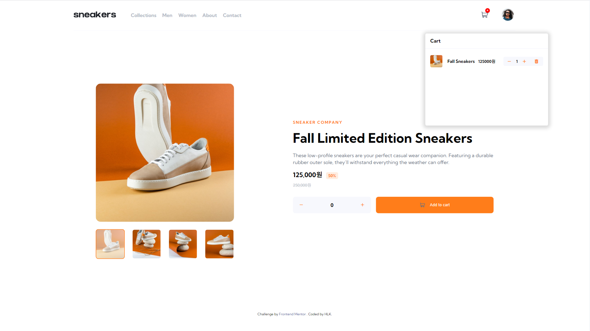
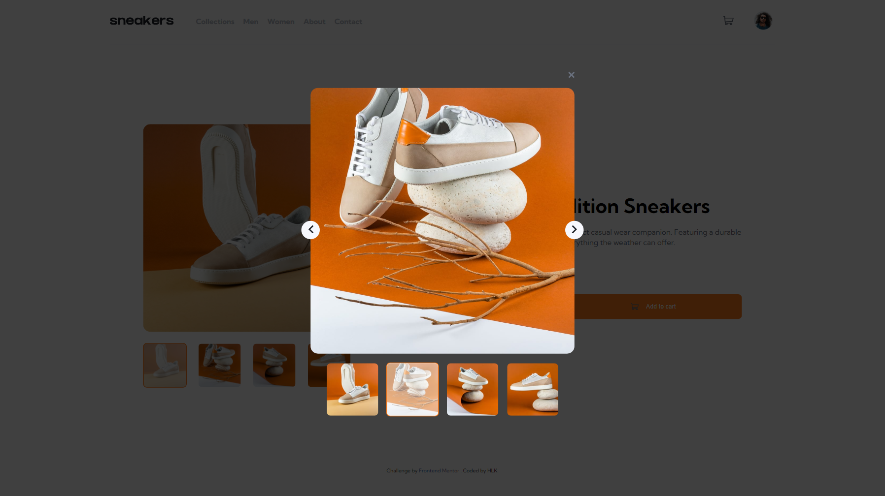
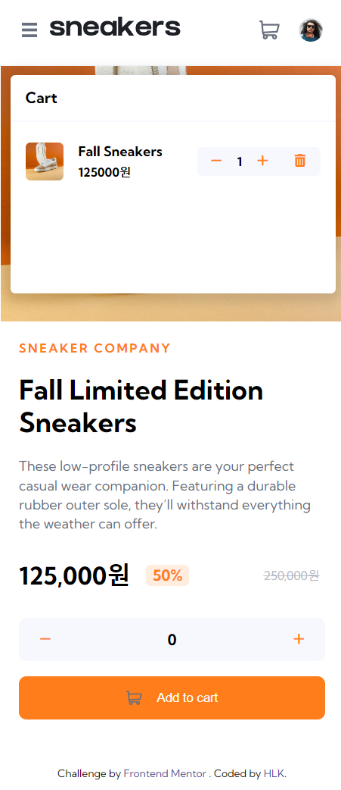

# Ecommerce product page

## Description

: Vanilla JS를 사용하여 실제 쇼핑몰의 상세 페이지를 구현함.

## Language

- HTML
- CSS
- JavaScript

### 디자인 및 소스 참고 사이트

[Frontend Mentor](https://www.frontendmentor.io)

### 프리뷰

\*배포 사이트 : https://hlk1m.github.io//Ecommerce-product-page/

<b>Desktop</b> 

   
<b>Mobile</b> 

